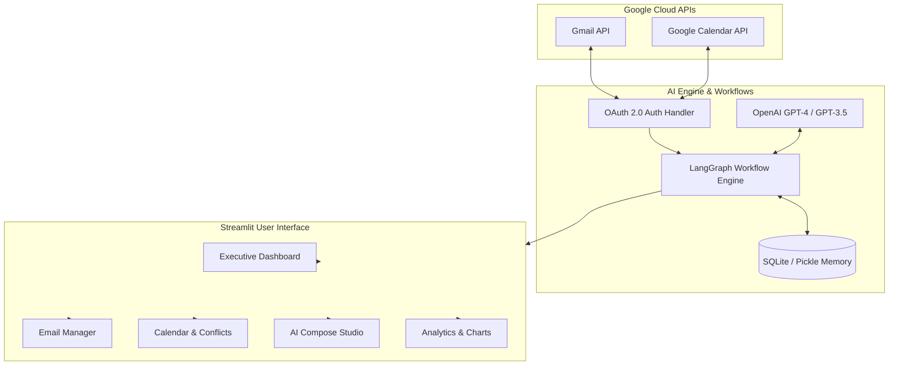

# 🤖 AI Email & Calendar Assistant

<p align="center">
  
</p>

<p align="center">
  <em>An ambient, autonomous AI productivity assistant that seamlessly unites Gmail, Google Calendar, and LangGraph/LangChain to prioritize your inbox, resolve meeting conflicts, and draft contextual replies in real time.</em>
</p>

<p align="center">
  <a href="#-key-features"></a>
  <a href="#-quick-start"></a>
  <a href="https://streamlit.io/"></a>
  <a href="https://python.org"></a>
  <a href="https://platform.openai.com/"></a>
  <a href="https://developers.google.com/workspace"></a>
</p>

---

## 📖 Table of Contents

- [Overview](#-overview)
- [Key Features](#-key-features)
- [Architecture](#-architecture)
- [Tech Stack](#-tech-stack)
- [Directory Structure](#-directory-structure)
- [Prerequisites](#-prerequisites)
- [Quick Start Guide](#-quick-start-guide)
  - [1. Clone & Set Up Virtual Environment](#1-clone--set-up-virtual-environment)
  - [2. Install Dependencies](#2-install-dependencies)
  - [3. Configure Google OAuth 2.0 Credentials](#3-configure-google-oauth-20-credentials)
  - [4. Set Up Environment Variables](#4-set-up-environment-variables)
  - [5. Run the Application](#5-run-the-application)
- [Feature Walkthrough](#-feature-walkthrough)
  - [🏠 Executive Dashboard](#-executive-dashboard)
  - [📧 Email Intelligence Hub](#-email-intelligence-hub)
  - [📅 Smart Calendar & Schedule Manager](#-smart-calendar--schedule-manager)
  - [⚠️ AI Conflict Detection & Auto-Resolution](#️-ai-conflict-detection--auto-resolution)
  - [✍️ AI Compose & Draft Studio](#️-ai-compose--draft-studio)
  - [🤖 Autonomous LangGraph Workflows](#-autonomous-langgraph-workflows)
- [Configuration Reference](#-configuration-reference)
- [Security & Privacy](#-security--privacy)
- [Contributing](#-contributing)
- [License](#-license)

---

## 🌟 Overview

Tired of email overload and scheduling headaches? **AI Email & Calendar Assistant** transforms how you manage your day by functioning as a tireless executive assistant:

- **Categorizes & Prioritizes** emails based on urgency and actionable intent.
- **Detects Scheduling Conflicts** across your Google Calendar events.
- **Finds Available Time Slots** and autonomously prepares polite reschedule drafts.
- **Drafts Context-Aware Replies** matching your tone and meeting constraints.
- **Maintains Persistent Memory** to learn your preferences and communication patterns.

---

## ✨ Key Features

| Capability | Description |
| :--- | :--- |
| 📬 **Intelligent Prioritization** | Scores incoming emails from `1 to 100` and sorts them into Action Required, Meeting Requests, Follow-ups, Newsletters, etc. |
| 🔍 **Deep Sentiment Analysis** | Assesses emotional urgency, sender tone, and VIP status to surface high-priority communications first. |
| 📅 **Live Calendar Sync** | Fetches upcoming events, inspects attendee lists, detects overlaps, and pinpoints free windows. |
| ⚡ **One-Click Conflict Resolution** | Proposes optimal replacement slots and generates ready-to-send reschedule responses. |
| 🧠 **LangGraph Autonomous State Machine** | Multi-node cognitive graphs orchestrate multi-step email review, categorization, and action planning. |
| 💾 **Persistent Memory & Checkpoints** | SQLite-backed checkpoints preserve workflow states and conversational context across app sessions. |
| 🎨 **Modern Streamlit UI/UX** | Dark-mode interface, responsive cards, rich Plotly analytics charts, and intuitive navigation. |
| 🛡️ **Privacy & Local Security** | Zero external database storage for your emails; tokens and checkpoints are retained securely on your local machine. |

---

## 🏗️ Architecture



---

## 💻 Tech Stack

- **Frontend & Dashboard:** [Streamlit](https://streamlit.io/), [Plotly](https://plotly.com/), HTML/CSS Custom Styling
- **AI & Agent Orchestration:** [LangChain](https://www.langchain.com/), [LangGraph](https://github.com/langchain-ai/langgraph), [OpenAI API](https://platform.openai.com/)
- **Google Integrations:** [Google APIs Python Client](https://github.com/googleapis/google-api-python-client), `google-auth-oauthlib`
- **Data & State Management:** [Pydantic v2](https://docs.pydantic.dev/), SQLite, Python Pickle
- **Environment & Utilities:** `python-dotenv`, `python-dateutil`, `requests`

---

## 📁 Directory Structure

```plaintext
AI-Email-Assitant/
├── assets/                          # Images, banners, and static UI illustrations
│   └── login_illustration.jpg
├── memory/                          # Persistent state storage & checkpoints
│   ├── checkpoints.db               # SQLite database for LangGraph state history
│   └── conversation_memory.pkl      # Serialized agent memory
├── ambient_email_assistant_enhanced.py  # Core backend logic, Google API wrappers, & LangGraph nodes
├── streamlit_app.py                 # Multi-page interactive Streamlit frontend
├── env.example                      # Template for environment configuration
├── requirements.txt                 # Project Python dependencies
├── start_streamlit.bat              # One-click Windows launch script
├── start_streamlit.sh               # One-click Linux / macOS launch script
├── PRIVACY.md                       # Data usage policy & privacy guarantees
├── TERMS.md                         # Terms of service and usage guidelines
└── README.md                        # Project documentation
```

---

## 📋 Prerequisites

Ensure you have the following installed and configured before starting:

- **Python 3.9+** (Python 3.10 or 3.11 recommended)
- **Google Cloud Platform (GCP) Account** with an active project
- **OpenAI API Key** (for smart categorization, sentiment analysis, and drafting)

---

## 🚀 Quick Start Guide

### 1. Clone & Set Up Virtual Environment

```bash
# Clone the repository
git clone https://github.com/your-username/AI-Email-Assitant.git
cd AI-Email-Assitant

# Create a virtual environment
python -m venv .venv

# Activate the virtual environment
# Windows (PowerShell):
.venv\Scripts\Activate.ps1
# Windows (CMD):
.venv\Scripts\activate.bat
# Linux / macOS:
source .venv/bin/activate
```

### 2. Install Dependencies

```bash
pip install --upgrade pip
pip install -r requirements.txt
```

### 3. Configure Google OAuth 2.0 Credentials

1. Go to the [Google Cloud Console](https://console.cloud.google.com/).
2. Create a new project (e.g., `AI-Email-Assistant`).
3. Enable the following APIs in **APIs & Services > Library**:
   - **Gmail API**
   - **Google Calendar API**
4. Configure the **OAuth Consent Screen**:
   - User Type: **External** (or Internal for Workspace organizations)
   - Add Test Users: Include the Gmail address you will use for testing.
5. Create OAuth 2.0 Credentials:
   - Go to **Credentials > Create Credentials > OAuth client ID**.
   - Application Type: **Desktop app**.
   - Name: `AI Email Assistant Desktop Client`.
6. Download the JSON credentials file, rename it to `credentials.json`, and place it in the root of the project directory.

> [!NOTE]
> The app requires the following Google OAuth scopes (configured automatically on first login):
> - `https://www.googleapis.com/auth/gmail.readonly`
> - `https://www.googleapis.com/auth/gmail.send`
> - `https://www.googleapis.com/auth/gmail.compose`
> - `https://www.googleapis.com/auth/gmail.modify`
> - `https://www.googleapis.com/auth/calendar.readonly`
> - `https://www.googleapis.com/auth/calendar.events`

### 4. Set Up Environment Variables

Copy the example environment file and configure your API keys:

```bash
# Copy template
cp env.example .env
```

Open `.env` and fill in your OpenAI API Key and preferences:

```ini
# OpenAI API Key (Required for AI categorization and auto-drafting)
OPENAI_API_KEY=sk-your-openai-key-here

# LLM Model Configuration (Default: gpt-4)
LLM_MODEL=gpt-4
LLM_TEMPERATURE=0.7

# Fetch Limits
MAX_EMAILS=50
CALENDAR_DAYS_AHEAD=30

# Memory Storage Paths
MEMORY_DIR=./memory
CHECKPOINT_DB=./memory/checkpoints.db
```

### 5. Run the Application

#### Option A: One-Click Startup Script

- **Windows:** Double-click `start_streamlit.bat` or run:
  ```cmd
  start_streamlit.bat
  ```
- **Linux / macOS:** Make executable and run:
  ```bash
  chmod +x start_streamlit.sh
  ./start_streamlit.sh
  ```

#### Option B: Standard Streamlit Command

```bash
streamlit run streamlit_app.py
```

The application will launch in your default web browser at **`http://localhost:8501`**.

---

## 🎯 Feature Walkthrough

### 🏠 Executive Dashboard
Provides an immediate birds-eye overview of your digital workspace:
- Total unread emails, calendar meetings today, and detected conflicts.
- Priority distribution metrics and recent urgent communications.
- Actionable AI summary cards for quick triage.

### 📧 Email Intelligence Hub
- **Smart Filtering:** Filter by priority score, categorization tags (Action Required, Meeting Request, Follow-up, etc.), sender, or date.
- **Deep Email Viewer:** Read full emails, view attachments, inspect sender history, and examine AI reasoning.
- **Fast Reply:** Click to generate a contextual, professional reply in seconds.

### 📅 Smart Calendar & Schedule Manager
- Visual schedule grouped by day and week.
- Displays attendees, status, meeting links, and descriptions.
- Instant scanning for double-bookings and schedule overlaps.

### ⚠️ AI Conflict Detection & Auto-Resolution
- Automatically highlights conflicting events side by side.
- AI scans your calendar to compute the next available free windows.
- Automatically generates polite reschedule messages to attendees with proposed alternative slots.

### ✍️ AI Compose & Draft Studio
- Context-rich email drafting assistant.
- Choose tone (Professional, Friendly, Direct, Urgent).
- Save directly as a Gmail Draft or send immediately with confidence.

### 🤖 Autonomous LangGraph Workflows
- Trigger comprehensive full-inbox AI scans that run autonomous multi-node graphs.
- Track graph execution node-by-node with real-time progress indicators.

---

## ⚙️ Configuration Reference

| Environment Variable | Default | Description |
| :--- | :--- | :--- |
| `OPENAI_API_KEY` | *None* | OpenAI API Key used for AI analysis and text generation. |
| `LLM_MODEL` | `gpt-4` | LLM model name (e.g. `gpt-4`, `gpt-4-turbo-preview`, `gpt-3.5-turbo`). |
| `LLM_TEMPERATURE` | `0.7` | Controls response randomness (`0.0` for deterministic, `1.0` for creative). |
| `MAX_EMAILS` | `50` | Maximum number of emails fetched during an inbox synchronization. |
| `CALENDAR_DAYS_AHEAD`| `30` | Number of forward days to fetch for calendar synchronization. |
| `MEMORY_DIR` | `./memory` | Directory where persistent files and SQLite databases are stored. |
| `CHECKPOINT_DB` | `./memory/checkpoints.db` | Path to SQLite state database for LangGraph checkpoints. |

---

## 🔒 Security & Privacy

We treat your personal and professional communications with the highest standard of privacy:

- **Local Storage Only:** Authentication tokens (`token.json`), conversation memories, and checkpoints remain exclusively on your local machine.
- **No Third-Party Data Brokers:** Your email content is never sold, shared, or retained in any third-party database.
- **Direct Google API Access:** Communication happens directly between your local machine and official Google API endpoints.
- Read our full [Privacy Policy](file:///c:/Users/palan/OneDrive/Documents/InboxAI/AI-Email-Assitant/PRIVACY.md) and [Terms of Service](file:///c:/Users/palan/OneDrive/Documents/InboxAI/AI-Email-Assitant/TERMS.md).

---

## 🤝 Contributing

Contributions, issues, and feature requests are welcome!

1. Fork the Project
2. Create your Feature Branch (`git checkout -b feature/AmazingFeature`)
3. Commit your Changes (`git commit -m 'Add some AmazingFeature'`)
4. Push to the Branch (`git push origin feature/AmazingFeature`)
5. Open a Pull Request

---

## 📄 License

Distributed under the MIT License. See `LICENSE` for more information.

---

<p align="center">
  Developed by <a href="mailto:palanivelyuvanesh@gmail.com"><strong>Yuvanesh Palanivel</strong></a>
</p>

